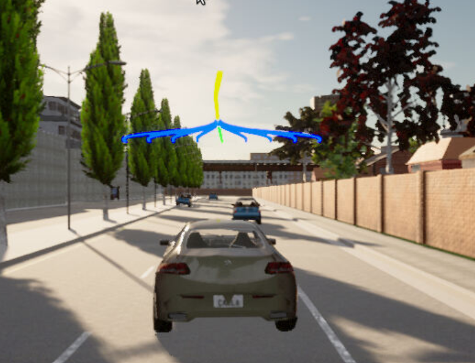
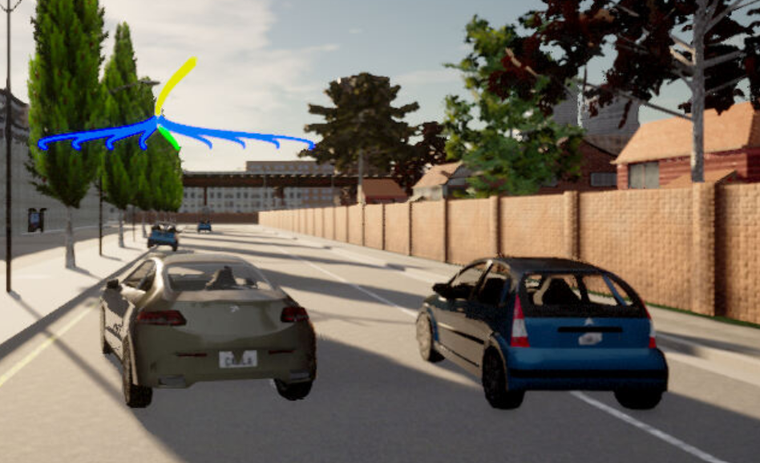
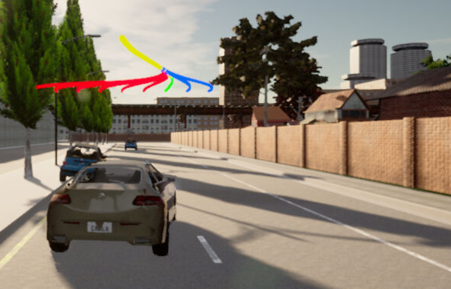
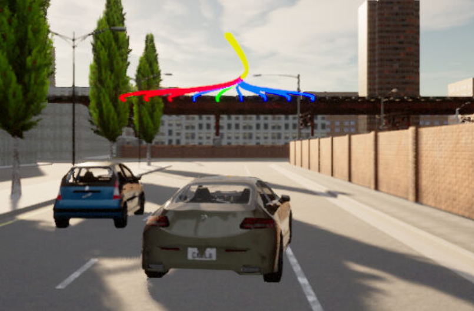

# Motion Planning and Decision Making for Autonomous Vehicles

This project is done in case of Self-Driving Car Engineer Nanodegree<br/>
https://www.udacity.com/course/self-driving-car-engineer-nanodegree--nd013

## Description

In this project, we will implement two of the main components of a traditional hierarchical planner: The Behavior Planner and the Motion Planner. <br>
Both will work in unison to be able to:

>- Avoid static objects (cars, bicycles and trucks) parked on the side of the road (but still invading the lane). The vehicle must avoid crashing with these vehicles by executing either a “nudge” or a “lane change” maneuver.
>- Handle any type of intersection (3-way, 4-way intersections and roundabouts) by STOPPING in all of them (by default)
>- Track the centerline on the traveling lane.

## Usage

Firstly, to use MotionPlanning_-_DecisionMaking_AV, Carla simulator needs to be running in the background. 

Firsty unzip MotionPlanning_-_DecisionMaking_AB/project/starter_files/lib.7z in order to be as follows:

>- MotionPlanning_-_DecisionMaking_AB/project/starter_files/eigen-3.3.7
>- MotionPlanning_-_DecisionMaking_AB/project/starter_files/libcarla-install
>- MotionPlanning_-_DecisionMaking_AB/project/starter_files/rpclib


To do it, running the following commands:

```
su - student
// Will say permission denied, ignore and continue 
cd /opt/carla-simulator/
SDL_VIDEODRIVER=offscreen ./CarlaUE4.sh -opengl
```

Meanwhile, Carla Simulator is running in a dedicated prompt, compile and run MotionPlanning_-_DecisionMaking_AV application using the following commands:

```
git clone https://github.com/pArtheum/MotionPlanning_-_DecisionMaking_AV.git
cd MotionPlanning_-_DecisionMaking_AV/project
./install-ubuntu.sh
cd starter_files/
cmake .
make
cd MotionPlanning_-_DecisionMaking_AV/project
./run_main.sh
// This might silently fail 
// ctrl + C to stop and restart
./run_main.sh again


// If error bind is already in use, or address already being used
ps -aux | grep carla
kill id
```

## Results

For the number of allowed paths, we select 9. This choices is due to a three line road. I think it allows enough possibility for nice and smooth driving.




In the picture below, we noticing that the collision module is detecting an obstacle on sixth of nine paths (red paths above the ego car)


### Improvements

One of the noted improvements, after going in centered line after passing parked blue car. The ego car is slightly overtaken by moving to right line (but not fully) when the third blue car is reached. In my opinion, the ego car should remain in the same line. I think, the slight deviation is unnecessary. A parameter tuning might be required for this use case.



